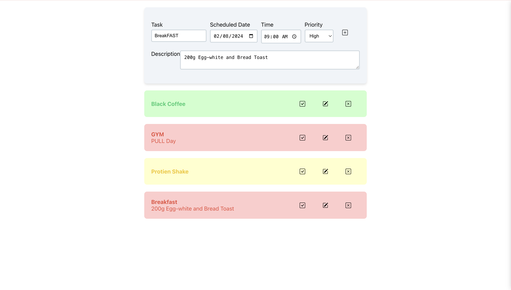

# **Todo List App** 📝  
**Stay organized. Be productive. Simplify your life.**  

Welcome to the **Todo List App**—your personal assistant for managing daily tasks! Designed to be simple yet feature-rich, this app helps you stay on top of work, personal errands, or study schedules, all in one place.  

# Todo List App



---

## 🌟 **Key Features**  
- **✨ Add Tasks:** Quickly create tasks with priority levels and due dates.  
- **📅 View Today's Tasks:** Focus on what matters today with a dedicated view.  
- **✅ Mark as Complete:** Check off tasks as you smash through your to-do list.  
- **✏️ Edit & Delete Tasks:** Easily update or remove tasks as plans change.  
- **📱 Responsive Design:** Enjoy a sleek, user-friendly interface on any device.  

---

## 🛠️ **Tech Stack**  
### **Frontend:**  
- **React.js** – Fast, dynamic user interfaces.  
- **CSS** – Beautiful and responsive design.  

### **Backend:**  
- **Django** – Robust and scalable server-side logic.  
- **Django REST Framework** – Seamless API integration.  

### **Database:**  
- **PostgreSQL** – Reliable and efficient data management.  

### **Additional Tools:**  
- **Docker** – Effortless containerized deployment.  
- **Axios** – Smooth communication between frontend and backend.  
- **Git** – Version control for collaborative development.  

---

## 🚀 **Getting Started**  

### **Prerequisites:**  
Ensure the following are installed on your system:  
- **Docker**  
- **Docker Compose**  

---

### **Installation Steps:**  
1. **Clone the repository:**  
   ```bash  
   git clone https://github.com/Dhanush-Abhiram/TODO.git  
   ```  

2. **Navigate to the project directory:**  
   ```bash  
   cd TODO  
   ```  

3. **Run the app using Docker Compose:**  
   ```bash  
   docker-compose up  
   ```  

4. Open your browser and visit **[http://localhost:8080](http://localhost:8080)** to explore the app.  

---

## 📖 **How It Works**  
The `docker-compose.yml` file automates the setup of:  
- **Frontend Service:** React.js served via Nginx.  
- **Backend Service:** Django API integrated with PostgreSQL.  
- **Database Service:** PostgreSQL for efficient data handling.  

---

## 🛡️ **Troubleshooting**  
If you encounter issues:  
1. Verify Docker and Docker Compose are installed and running.  
2. Check the app logs using:  
   ```bash  
   docker-compose logs  
   ```  
3. Refer to the project documentation or open an issue on GitHub for support.  

---

Ready to stay organized and productive? Clone the repository now and experience the power of streamlined task management!  

**Happy Organizing!** 🎉  

--- 

This version has a sleek, professional tone while being visually appealing and concise. Let me know if you'd like any further tweaks! 😊
